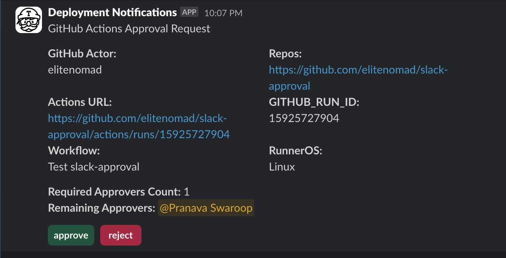
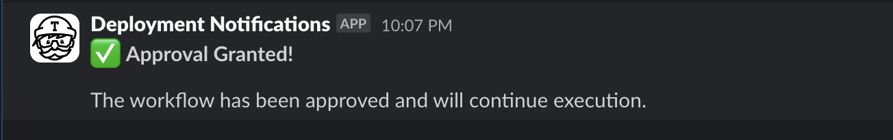

# slack-approval

custom action to send approval request to Slack





- When action is triggered, Post or Update in Slack, a reply message appears simultaneously with "Approve" and "Reject" buttons
- Clicking on "Approve" will execute next steps
- Clicking on "Reject" will cause workflow to fail

# How To Use

- First, create a Slack App and install in your workspace.
- Second. set the `App Manifest`
```json
{
    "display_information": {
        "name": "ApprveApp"
    },
    "features": {
        "bot_user": {
            "display_name": "ApproveApp",
            "always_online": false
        }
    },
    "oauth_config": {
        "scopes": {
            "bot": [
                "app_mentions:read",
                "channels:join",
                "chat:write",
                "users:read"
            ]
        }
    },
    "settings": {
        "interactivity": {
            "is_enabled": true
        },
        "org_deploy_enabled": false,
        "socket_mode_enabled": true,
        "token_rotation_enabled": false
    }
}
```

```
jobs:
  approval:
    runs-on: ubuntu-latest
    steps:
      - name: send approval
        uses: tigerwest/slack-approval@main
        env:
          SLACK_APP_TOKEN: ${{ secrets.SLACK_APP_TOKEN }}
          SLACK_BOT_TOKEN: ${{ secrets.SLACK_BOT_TOKEN }}
          SLACK_SIGNING_SECRET: ${{ secrets.SLACK_SIGNING_SECRET }}
          SLACK_CHANNEL_ID: ${{ secrets.SLACK_CHANNEL_ID }}
        timeout-minutes: 10
```

- Set environment variables

  - `SLACK_APP_TOKEN`

    - App-level tokens on `Basic Information page`. (starting with `xapp-` )

  - `SLACK_BOT_TOKEN`

    - Bot-level tokens on `OAuth & Permissions page`. (starting with `xoxb-` )

  - `SLACK_SIGNING_SECRET`

    - Signing Secret on `Basic Information page`.

  - `SLACK_CHANNEL_ID`

    - Channel ID for which you want to send approval.

- Set Inputs

  - `baseMessageTs`
    - If provided, updates the target message. If not provided, creates a new message
    - Optional

  - `approvers`
    - A comma-separated list of approvers' slack user ids
    - Required

  - `minimumApprovalCount`
    - The minimum number of approvals required
    - Optional (default: "1")

  - `baseMessageBlocks`
    - The title of the message indicating approval is needed
    - Optional (default: "[]")

  - `successMessageBlocks`
    - The message body indicating approval is pending
    - Optional (default: "[]")

  - `failMessageBlocks`
    - The message body indicating approval has been rejected
    - Optional (default: "[]")


- outputs

- `mainMessageTs`
  - Timestamp of the main message sent to Slack

- `replyMessageTs`
  - Timestamp of the reply message sent to Slack 

